#### 2.10综合练习
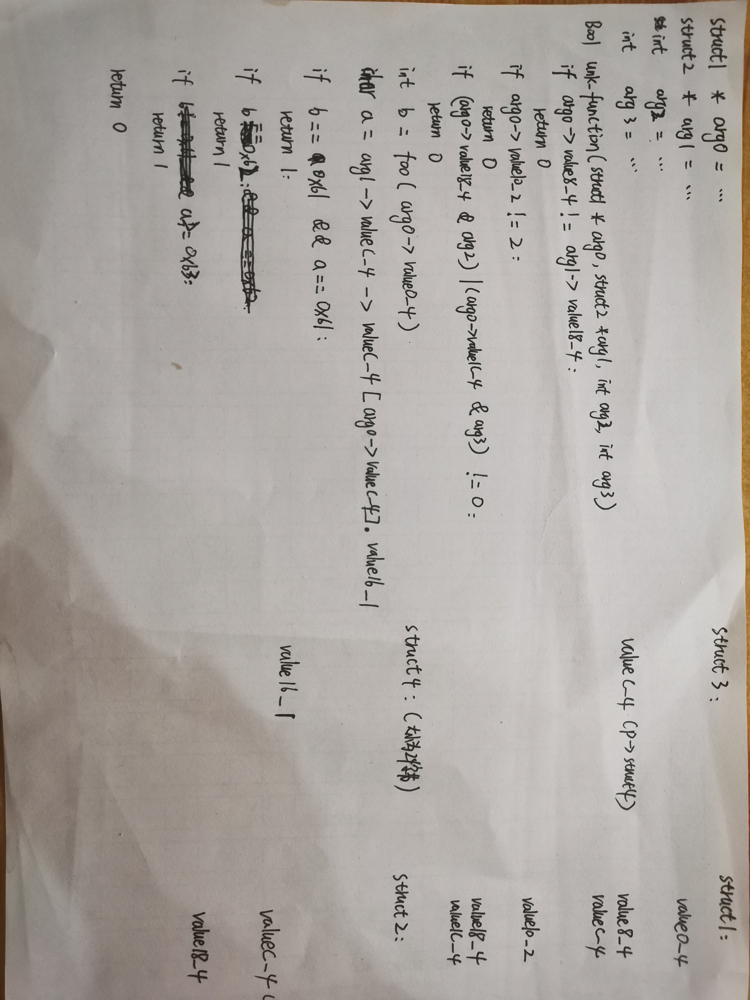
练习后感觉对arm指令又多了一点理解

#### 2.11下一步
买设备留待学完逆向工程实践这本书的全部内容后再进行

#### 2.12
##### (1)
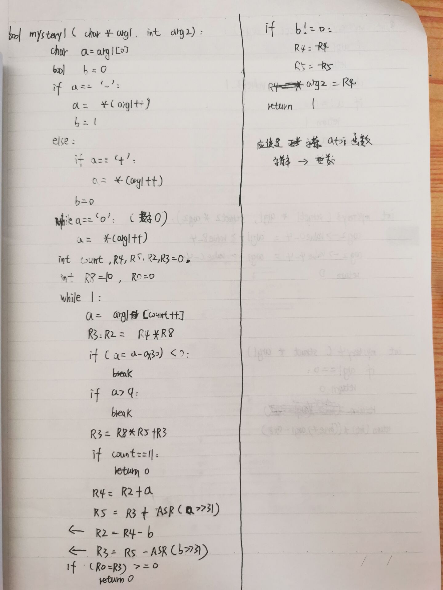
##### (2)
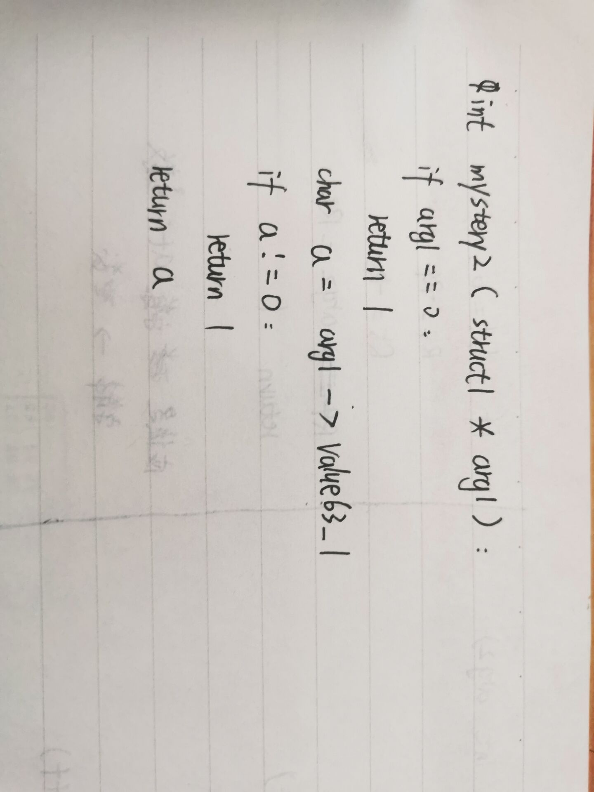
##### (3)
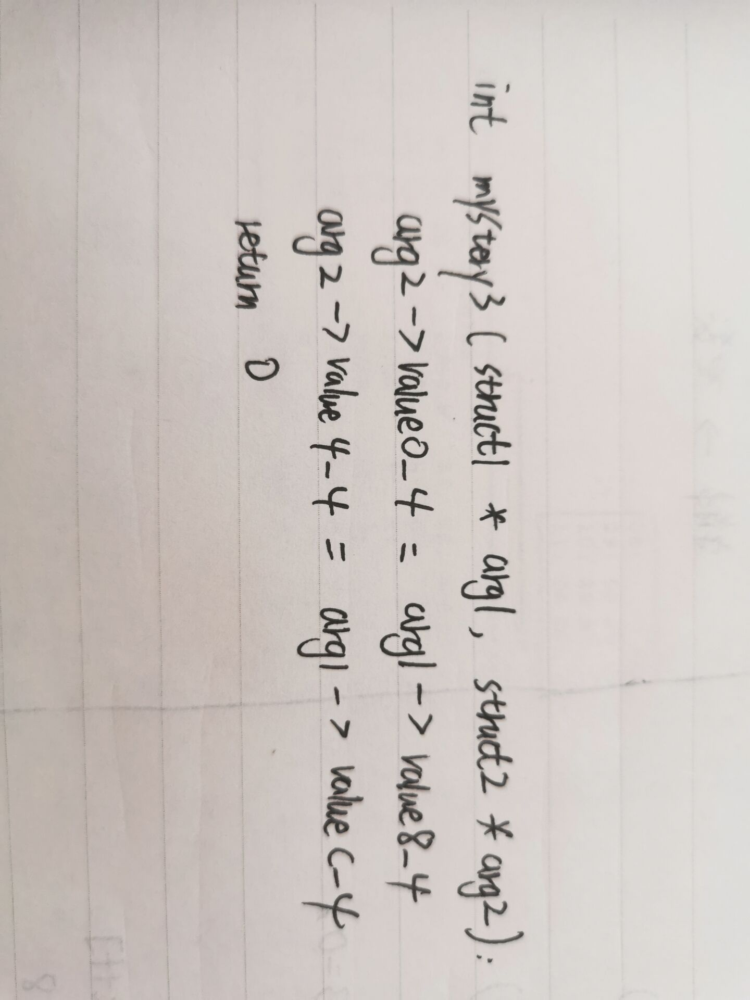
##### (4)
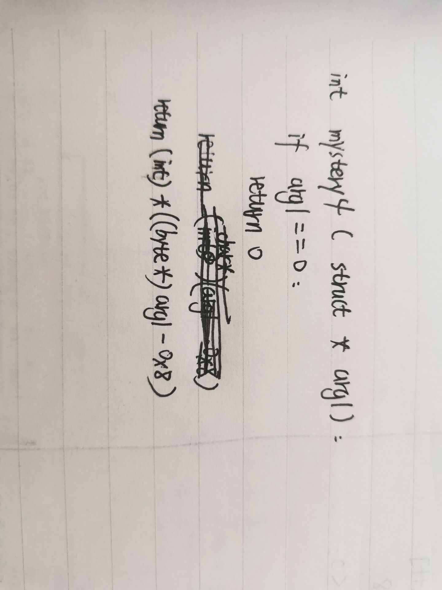
##### (5)
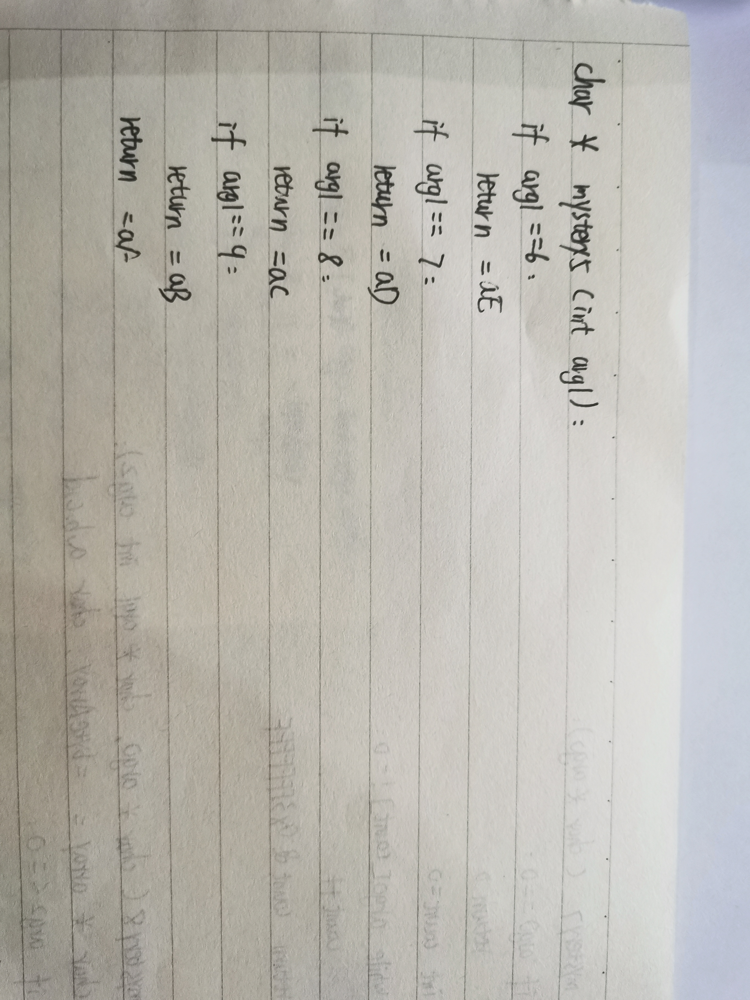
##### (6)
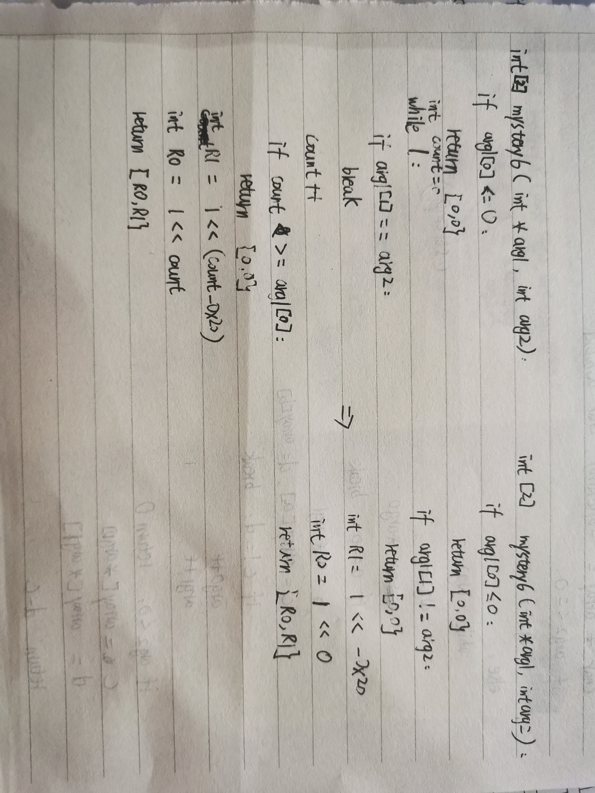
##### (7)
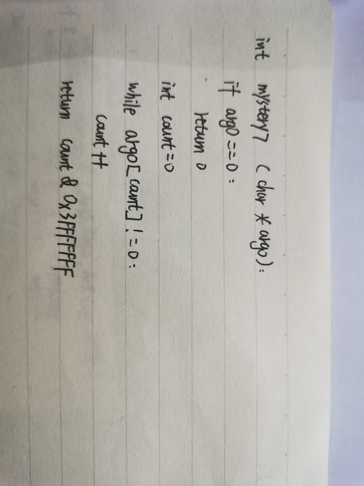
##### (8)
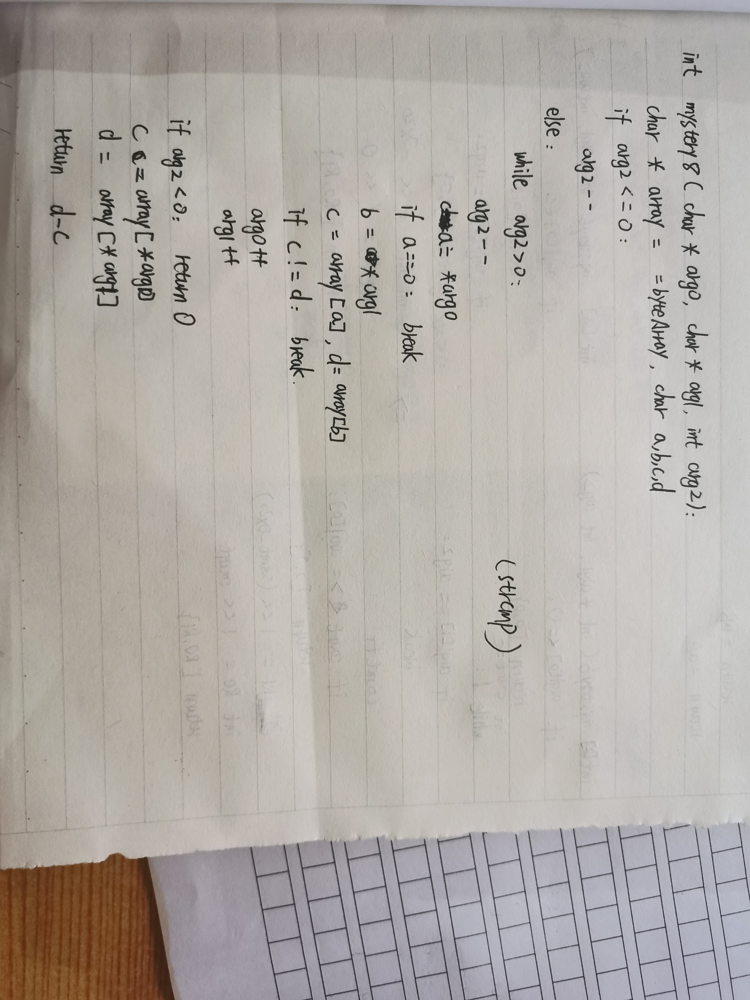
##### (9)
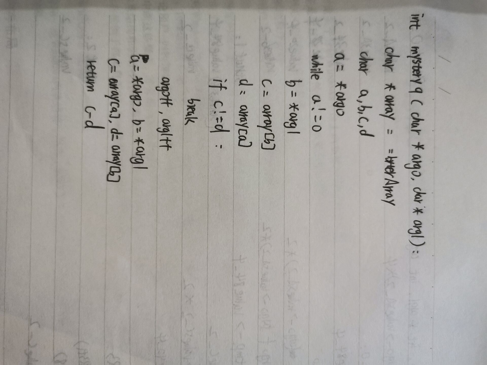
##### (10)
就很普通的调函数过程，因为我太懒了就没做。。。
##### (11)
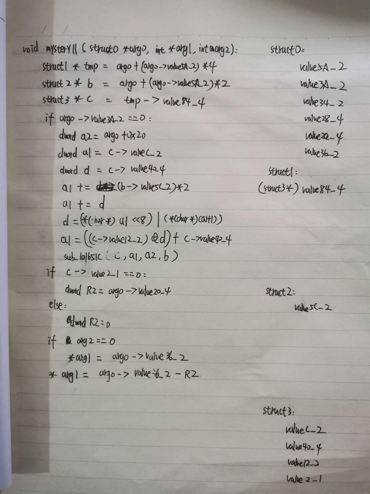